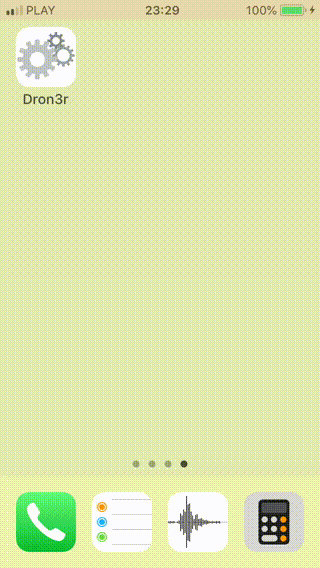

# Dron3r

## Purpose

This repository is meant as an educational resource on the subject of using software design patterns in iOS apps written in Swift.

## Problem

A company has a number of drones flying around the country. You have been tasked to build a system to track the location of every drone in real-time. The system's dashboard will only display the last location of the drones, so the backend doesn't need to worry about the history. You can store the state of the application in-memory for simplicity reasons.

Each drone should be associated with a unique identifier, and should report its geo-location coordinates to the central server in real-time through a cellular modem connection. Cellular modem connections are expensive, therefore you need to make sure the drones report back their location using as little data as possible.

The dashboard should be a simple single-page application displaying the list of active drones, by their unique identifiers, along with their current speed. You should visually highlight the drones that have not been moving for more than 10 seconds.

## Assumptions

- since the system is to be considered real-time, drone location is reported to the server the moment it changes (if it does not change, it is not re-submitted)
- the frequency of real-time drone position updates will be limited by drone GPS hardware capabilities (callback frequency, accuracy, etc.)
- a unique identifier is assumed to be a Globally Unique Identifier (GUID) - non- human-readable, non- meaningfully sortable
- a drone cellular modem connection is assumed to be over a Virtual Private Network (VPN), thus considered already authenticated and encrypted
- due to the complete lack of a specification on how to report client-side and server-side errors, Apple unified logging system has been used for client (iOS) and server (macOS) compatibility

## Design Decisions

- performance: client/server communication has been implemented over a connection-less UDP protocol
- cellular connection cost: client/server data submission has been implemented through encoding/decoding into a binary format, yielding 64 bytes per drone location report
- compression of very small buffers is considered impractical - ZLIB compresses 64 bytes into 62 bytes, LZMA compresses 64 bytes into 112 bytes, etc.
- performance: the server module and the UI module (a dashboard) share data through WebSockets
- the WebSockets server currently supports only a single client dashboard session, for implementation simplicity

## Design Suggestions

- if using a VPN is not possible, implement drone location report authentication (a secret cookie, electronic signing, IP range filtering, etc.) and/or encryption
- design a specification on how to report client-side, server-side and dashboard errors

## Major Components

|         | File | Purpose |
----------|------|----------
:octocat: | [Server.swift](Dron3r/Server/Server.swift) | a network server, in: connectionless, ping/pong-less UDP (User Datagram Protocol), out: connection-bound WebSockets - in separate threads, on localhost
:octocat: | [Client.swift](Dron3r/Test/Client.swift) | a network client, connectionless, ping/pong-less UDP, a bunch of simulated drones pseudo-flying around - in a separate thread, on localhost
:octocat: | [DashboardViewController.swift](Dron3r/App/DashboardViewController.swift) | a UI client (a dashboard), a network client, connection-bound WebSockets

## Notable Implementation Files

|         | File | Purpose |
----------|------|----------
:octocat: | [Drone.swift](Dron3r/Core/Drone.swift) | represents an abstract piece of hardware - with Location, Speed, etc.
:octocat: | [ClientDrone.swift](Dron3r/Client/ClientDrone.swift) | represents an abstract network-enabled piece of hardware (as opposed to a server-side remote drone)
:octocat: | [Memento.swift](Dron3r/Core/Memento.swift) | represents a particular state of a hardware/remote drone, can be binary encoded/decoded
:octocat: | [SimulatedDrone.swift](Dron3r/Client/SimulatedDrone.swift) | represents a simulated hardware drone that receives GPS updates - does NOT allow manual drone status updates (vs. RemoteDrone)
:octocat: | [BrokenDrone.swift](Dron3r/Test/BrokenDrone.swift) | represents a simulated hardware drone that will break after some ticks (GPS update cycles) and no longer relocate
:octocat: | [RemoteDrone.swift](Dron3r/Core/RemoteDrone.swift) | represents a drone maintained by a server or a dashboard in its list of remote drones - allows manual drone status updates (vs. HardwareDrone)
:octocat: | [ObjectStore.swift](Dron3r/Core/ObjectStore.swift) | a memory-based object store, used by a server and a UI client (a dashboard) to accumulate remote drone data
:octocat: | [Config.swift](Dron3r/App/Config.swift) | a compile-time configuration accumulator
:octocat: | [Dron3rTests.swift](Dron3rTests/Dron3rTests.swift) | a (small) set of functional test cases (that are actually needed for such a compact project)
:octocat: | [Dron3rUITests.swift](Dron3rUITests/Dron3rUITests.swift) | an automated UI test case (XCUI) verifying that drones successfully report-in (client/server communication) and get highlighted if immobile

## Notes

- screen recordings of the app on iOS hardware have been included in the moving-GIF format, please see [test.JBXW8821.moving.gif](images/test.JBXW8821.moving.gif), [test.MZSX7321.moving.gif](images/test.MZSX7321.moving.gif) and [test.ODDH8203.moving.gif](images/test.ODDH8203.moving.gif)
